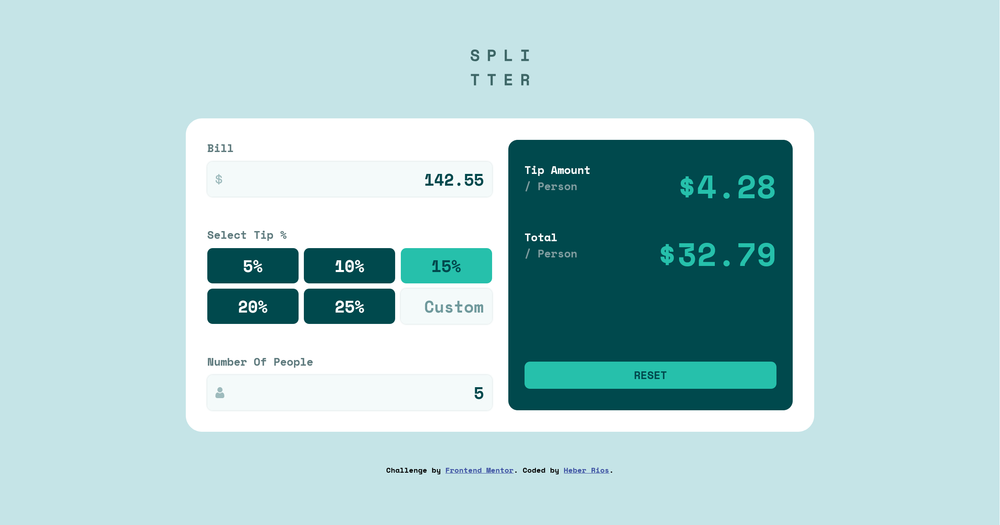
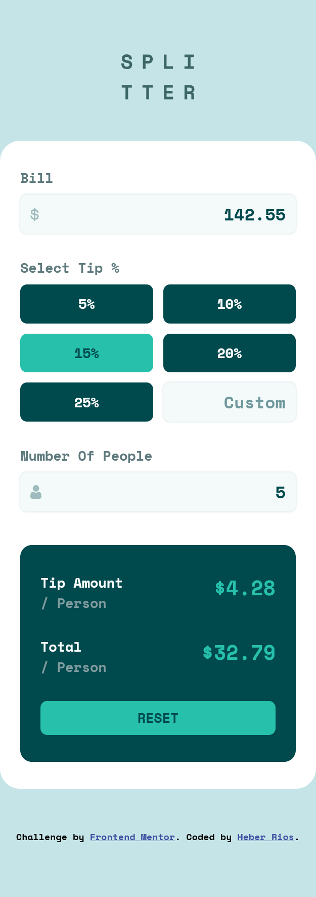

# Frontend Mentor - Tip calculator app solution

This is a solution to the [Tip calculator app challenge on Frontend Mentor](https://www.frontendmentor.io/challenges/tip-calculator-app-ugJNGbJUX).

## Table of contents

-   [Frontend Mentor - Tip calculator app solution](#frontend-mentor---tip-calculator-app-solution)
    -   [Table of contents](#table-of-contents)
    -   [Overview](#overview)
        -   [The challenge](#the-challenge)
        -   [Screenshot](#screenshot)
        -   [Links](#links)
    -   [My process](#my-process)
        -   [Built with](#built-with)
        -   [What I learned](#what-i-learned)
        -   [Continued development](#continued-development)
        -   [Useful resources](#useful-resources)
    -   [Author](#author)
    -   [Acknowledgments](#acknowledgments)

## Overview

### The challenge

Users should be able to:

-   View the optimal layout for the app depending on their device's screen size
-   See hover states for all interactive elements on the page
-   Calculate the correct tip and total cost of the bill per person

### Screenshot

-   Desktop design 
-   Mobile design 

### Links

-   [Solution URL](https://www.frontendmentor.io/solutions/tip-calculator-app-PLGxeiRuX8)
-   [Live Site URL](https://heberrios.github.io/tip-calculator-app/)

## My process

### Built with

-   Semantic HTML5 markup
-   CSS custom properties
-   CSS Flexbox
-   CSS GRID
-   Mobile-first workflow
-   JavaScript

### What I learned

The basic use of attribute selectors in CSS.

### Continued development

Have a better understanding of semantic HTML and fluid typography.

Have better website layout building sense.

### Useful resources

-   [Why use rem instead of px](https://www.youtube.com/watch?v=xCSw6bPXZks) - This taught me
    a new best practice for responsive design.

-   [Use of clamp](https://www.youtube.com/watch?v=erqRw3E-vn4&t=202s) - This is an amazing article which helped me understand
    CSS clamp better. I'd recommend it to anyone still learning this concept.

-   [Attribute selectors](https://developer.mozilla.org/en-US/docs/Web/CSS/Attribute_selectors)

## Author

-   Frontend Mentor - [@HeberRios](https://www.frontendmentor.io/profile/HeberRios)

## Acknowledgments

-   Frontend Mentor - [@JEWebDev](https://www.frontendmentor.io/profile/JEWebDev)
